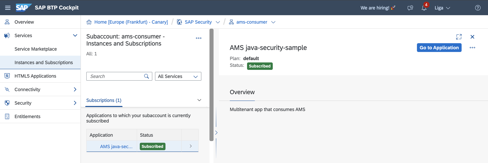

# Authorization Management Service (AMS) Jakarta EE Sample Application with Multitenancy & Zero Trust Integration

This Jakarta EE sample application demonstrates a secure, multitenant authorization scenario with **Zero Trust Identity
Services (ZTIS)** and certificate-based mTLS authentication. It utilizes:

- [jakarta-ams](https://github.wdf.sap.corp/CPSecurity/cloud-authorization-client-library-java/tree/master-1.x/jakarta-ams)
- [java-security](https://github.com/SAP/cloud-security-services-integration-library/tree/main/java-security)
- **ZTIS service** for dynamic, automatic mTLS certificate rotation and secure backend communication

The sample is deployed in a provider subaccount and subscribed to from a consumer subaccount. The latter is used to
access the application and needs to reside in the same region as the provider subaccount.

The app authenticates JWT tokens
from [SAP Identity Authentication Service (IAS)](https://help.sap.com/docs/identity-authentication), authorizes access
with [AMS](https://github.wdf.sap.corp/pages/CPSecurity/ams-docu/), and secures service-to-service calls via mTLS using
certificates provided by ZTIS and SPIFFE/SPIRE.

## Features

- Multi-tenancy with Cloud Foundry subscription model
- End-to-end OAuth2/OIDC authentication and AMS-based policy authorization
- **Zero Trust**: mTLS-secured backend with automatic X.509 certificate rotation using ZTIS & SPIFFE
- Easy inspection of SVID/certificate status via endpoints
- Health checks & troubleshooting endpoints

---

## Zero Trust (ZTIS) Integration

This sample app showcases how to integrate with **Zero Trust Identity Services (ZTIS)** for secure, certificate-based
mTLS communication between the backend and other services. All outgoing mTLS calls use short-lived, automatically
rotated SPIFFE X.509 certificates.

- The backend uses a custom `HttpClient` initialized with `SSLContext` from ZTIS/SPIRE:
  ```java
  httpClient = HttpClient.newBuilder()
      .sslContext(X509SourceSingletonWrapper.getInstance().getSslContextInstance())
      .build();
  ```
- The SPIFFE Workload API socket is discovered automatically (`SPIFFE_ENDPOINT_SOCKET` env or default
  `/tmp/spire-agent/public/api.sock`).
- The backend can programmatically inspect its own current SVID and certificate chain.

---

### Relevant Endpoints

| Endpoint                | Description                              | Auth Required | Zero Trust Details       |
|-------------------------|------------------------------------------|---------------|--------------------------|
| `/api/read`             | Basic resource access                    | Yes           | AMS policy protected     |
| `/api/advanced`         | Advanced resource access                 | Yes           | AMS policy protected     |
| `/api/health`           | Health check (readiness/liveness)        | No            | —                        |
| `/api/ztis/certificate` | Shows current SPIFFE certificate details | No            | mTLS & ZTIS info exposed |
| `/api/ztis/svid`        | Shows current SPIFFE SVID                | No            | mTLS & ZTIS info exposed |

> All `/api/ztis/*` endpoints let you inspect which certificate/SVID is currently active—useful for verifying live
> rotations.

---

## Getting Started with CF Deployment

### Prerequisites

- SAP BTP subaccounts (provider + consumer, same region)
- IAS tenant & trust established in provider subaccount
- ZTIS service instance bound to backend (see `manifest.yml`)
- CF CLI or Kyma/kubectl

### Deployment Steps

## Configure CF Deployment

First you need to login using the CF CLI:

```shell
cf login -u <YOUR USER> -o <CF ORG of your subaccount> -s <CF SPACE in your subaccount>
```

- Edit [`../vars.yml`](../vars.yml):
    - `ID`: unique identifier for resources (e.g., your user)
    - `LANDSCAPE_APPS_DOMAIN`: e.g., `cfapps.eu12.hana.ondemand.com`
    - `PROVIDER_SUBDOMAIN`: subdomain of provider subaccount

## Create Service Instances

### Create the identity service instance (with AMS enabled)

Use the IAS service broker to create the ``identity`` service instance:

```shell
cf create-service identity application jakarta-ams-identity -c ias-config.json --wait
```

Further information about identity service and its configuration can be
found [here](https://github.wdf.sap.corp/CPSecurity/Knowledge-Base/tree/master/08_Tutorials/iasbroker).

### Create the subscription manager service instance

Use the SMS service broker to create the ``sms`` service instance:

```shell
cf create-service subscription-manager provider jakarta-ams-sms -c sms-config.json --wait
```

Further information about subscription manager service and its configuration can be
found [here](https://int.controlcenter.ondemand.com/index.html#/knowledge_center/articles/7961284168e848efb9e0462e38b4075d).

### Zero Trust Identity Service (ZTIS)

To enable mTLS with ZTIS, create a ``ZTIS`` service instance in the provider subaccount:

```shell
cf create-service ztis default ztis-service --wait
```

Further information about zero trust service and its configuration can be
found [here](https://pages.github.tools.sap/pse/pse-docs/).
> The backend will automatically use the ZTIS credentials for mTLS.

## Build & Deploy the application

```sh
mvn clean package
cf push --vars-file ../vars.yml
```

## Subscribe to the app from another subaccount

In SAP BTP Cockpit go to a subaccount which resides in the same region as the provider subaccount where the application
was deployed.
Select `Instances and Subscriptions` from the left pane, click on `Create` button, look for
`Jakarta AMS Multitenancy Sample App (k8s)` or `Jakarta AMS Multitenancy Sample App (CF)` in the dropdown list and click
on `create`.



The subscription results in the backend app being called by the subscription manager at
its [subscription callback endpoint](src/main/java/com/sap/cloud/security/samples/CallbackServlet.java).
The callback responds with a subscription URL of the form

```
https://<subscriber subaccount subdomain>-<suffix to make URL unique>.<CF or k8s domain>
```

which is used to access the application in the context of the subscribed subaccount.
The approuter is configured (see [k8s](k8s/approuter.yaml) and [CF](manifest.yml) deployment) via the environment
variable `TENANT_HOST_PATTERN` to extract the subdomain from this URL.
This information is then used to retrieve the corresponding IAS tenant for authentication and authorization.

For this to work, the approuter needs to be reachable under the subscription URL.
In a productive setup this can be done by using
a [custom domain](https://pages.github.tools.sap/psecrypto/custom-domains/) in combination with a wildcard route.
For our sample deployment, we need to manually reconfigure the approuter.

Reconfigure approuter on Cloud Foundry

First, retrieve the subscription URL in the BTP Cockpit by clicking on the `Go to Application` button in the details of
the newly created subscription.
This should not work, but open a browser tab with the URL.
In SAP BTP Cockpit navigate to the provider subaccount and select the CF space where you deployed the sample app.
Select Routes from the left pane and create a new route ans use the hostname from the subcription URL retrieved above as
host.
Then map the route to the approuter application.

---

## Access the application

After successful subscription, a link under `Go to Application` button will redirect your request to your identity
tenant on the consumer side.
Login with your username and password or wait until single-sign-on has done its magic.
Upon successful login, the index page presents a variety of links for convenient access to different endpoints.

### Assign policies

The index page also contains a direct link to the AMS Admin UI where you can assign policies to a user.
Follow this [guide](https://github.wdf.sap.corp/pages/CPSecurity/ams-docu/docs/Manage/UserAssignments) for more details.

Changes should take effect after at most 60 seconds.
A re-login is not required.

### Verifying Zero Trust & Certificate Rotation

- Visit `/api/ztis/certificate` and `/api/ztis/svid` to see which SPIFFE certificate/SVID is currently in use by the
  backend.
- Certificates are **short-lived** and rotated automatically by ZTIS/SPIRE (lifetime is managed by your ZTIS/SPIRE
  configuration).
- To test mTLS and see rotation in action, trigger repeated requests (watch the leaf certificate value change over
  time).

---

## Troubleshooting

In case you run into any issues running the sample applicatin, a look into the logs might be helpful:

```shell
cf logs jakarta-ams-approuter --recent
cf logs jakarta-ams-backend --recent
```

- Use `/api/health` for readiness checks.
- Use `/api/ztis/certificate` to verify active SPIFFE certificate.

---

## Cleanup

```shell
cf unbind-service jakarta-ams-backend jakarta-ams-sms --wait
cf unbind-service jakarta-ams-backend jakarta-ams-identity --wait
cf unbind-service jakarta-ams-backend ztis-service --wait
cf unbind-service jakarta-ams-approuter jakarta-ams-sms --wait
cf unbind-service jakarta-ams-approuter jakarta-ams-identity --wait
cf unbind-service jakarta-ams-dcl-deployer jakarta-ams-identity --wait
cf delete -f jakarta-ams-backend
cf delete -f jakarta-ams-approuter
cf delete -f jakarta-ams-dcl-deployer
cf delete-service -f jakarta-ams-sms
cf delete-service -f jakarta-ams-identity
cf delete-service -f ztis-service
```

---

## Further References

- [Zero Trust Identity Services (ZTIS) documentation (internal)](https://github.tools.sap/pse/ztis/)
- [SPIFFE/SPIRE Java SDK](https://github.com/spiffe/java-spiffe)
- [Cloud Authorization Service Client Library for Spring Boot Applications](https://github.wdf.sap.corp/CPSecurity/cloud-authorization-client-library-java/tree/master/jakarta-ams)
- [Authorization Management Service (AMS) - Basics](https://github.wdf.sap.corp/pages/CPSecurity/ams-docu/)
- [Identity Service Broker](https://github.wdf.sap.corp/pages/CPSecurity/sci-dev-guide/docs/BTP/identity-broker)
- [How to fetch Token](https://github.com/SAP/cloud-security-xsuaa-integration/blob/main/docs/HowToFetchToken.md)
- [More ZTIS samples](https://github.tools.sap/pse/blueprints/tree/main)

