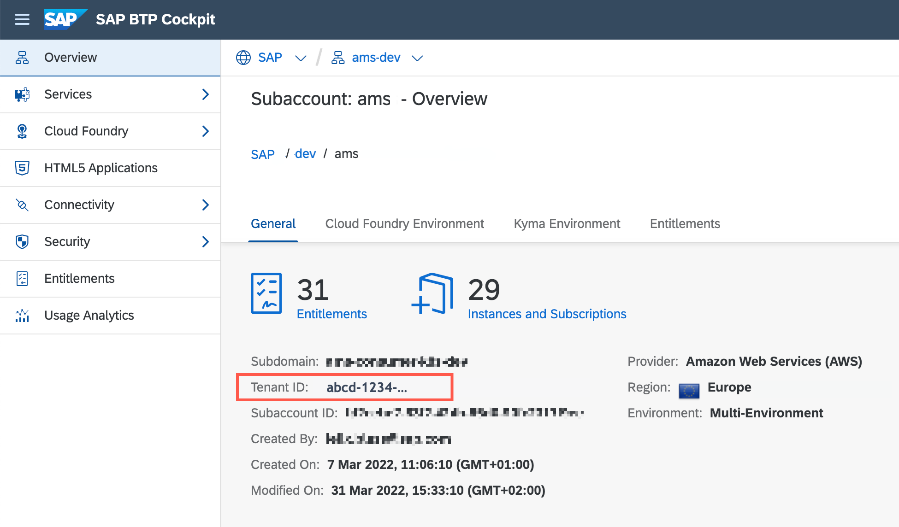
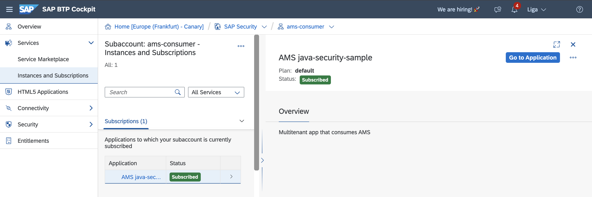

# Description
This sample is a Jakarta EE application that utilizes the [jakarta-ams](https://github.wdf.sap.corp/CPSecurity/cloud-authorization-client-library-java/tree/master-1.x/jakarta-ams) and [java-security](https://github.com/SAP/cloud-security-services-integration-library/tree/main/java-security) client libraries to authenticate JWT tokens issued by the [SAP Identity service](https://help.sap.com/docs/identity-authentication) and to authorize resource access managed by [AMS (Authorization Management Service)](https://github.wdf.sap.corp/pages/CPSecurity/ams-docu/).
The application uses the [SAP application router](https://www.npmjs.com/package/@sap/approuter) as OAuth 2.0 client and forwards the requests as reverse proxy to a Spring Boot backend application.
The Jakarta EE backend application checks for all incoming requests whether the user is authenticated and whether the user has the requested permissions assigned with AMS.

# Steps
1. Setup the IAS tenant follow this [guide](https://github.wdf.sap.corp/pages/CPSecurity/ams-docu/docs/Overview/HowTo_AMSConfig)

2. Enable authorization checks, application needs to declare authorization model in a form of [DCL files](https://github.wdf.sap.corp/pages/CPSecurity/ams-docu/docs/DCLLanguage/Declare) and provide these files to the AMS service.
   For a deeper understanding of how the AMS client library operates, refer to https://github.wdf.sap.corp/pages/CPSecurity/ams-docu/docs/ClientLibs/EnforceJava

3. Follow the deployment steps [Cloud Foundry](#deployment-on-cloud-foundry)


# Deployment on Cloud Foundry
On Cloud Foundry, your application gets deployed together with [AMS buildpack](https://github.com/SAP/cloud-authorization-buildpack), which uploads the DCL policies to the AMS server and provides a policy decision runtime as a *sidecar* process.
In the manifest you may need to adapt the ``appName`` and `directories` to your `AMS_DCL_ROOT`. The `directories` serves the `.dcl` files and the data which contains the assignments of users to policies.

## Compile the Java application
Run maven to package the application
```shell
mvn clean package
```

## Configure the manifest
The [vars](../vars.yml) contains placeholders that need to be adopted.
- `LANDSCAPE_APPS_DOMAIN` domain of the subaccount
- `ID` a unique identifier of the deployed app, you can use your i/d/c user 


- `PROVIDER_TENANT_NAME` is the IAS tenant name for the subaccount where the application is deployed. 
- `SUBSCRIBER_TENANT_NAME` is the tenant name for the  subaccount where the application will be subscribed from. 

ℹ️ You can find the name of the tenant by going to SAP BTP Cockpit subaccount -> Security -> Trust Configuration and checking the Custom Identity Provider for Applications. The 'Host Name' is prefixed with the tenant name e.g. ams.accounts.sap.com tenant name is ams

- `PROVIDER_TENANT_ID` is the Tenant ID that can be found in the Overview section in SAP BTP Cockpit of subaccount where the application is deployed.
- `SUBSCRIBER_TENANT_ID`is the Tenant ID that can be found in the Overview section in SAP BTP Cokcpit of subaccount where the application will be subscribed from.


<br> 

On Cloud Foundry your application gets deployed together with [AMS buildpack](https://github.com/SAP/cloud-authorization-buildpack), so that the policy decision runtime is available as a *sidecar*. In the manifest you may need to adapt the ``appName`` and `directories` to your `AMS_DCL_ROOT`. The `directories` serves the `.dcl` files and the data which contains the assignments of users to policies.


## Create required service instances
Create the required services [manually](#manually) or let the Identity service and Subscription Manager service be created [with a script](#with-a-script)


### Manually
Make sure you are in the project root of the spring sample. You need to replace all ``((LANDSCAPE_APPS_DOMAIN))`` and ``((ID))`` placeholders with your d/c/i-User in the [ias-config](ias-config.json) and [sms-config](sms-config.json) files.

#### Create Identity service instance
Use the [ias-config.json](./ias-config.json) to define the authentication settings
```shell
cf create-service identity application jakarta-ams-ias -c ias-config.json
```

#### Create Subscription Manager service instance
Use the [sms-config.json](./sms-config.json) to define the subscription manager settings
```shell
cf cs subscription-manager provider jakarta-ams-sms -c sms-config.json
```

### With a script
Make sure you're in `jakarta-security-ams` folder and execute the `setup-services.sh` script.

:bulb: if you don't have permissions to execute the script apply shell command `chmod 741`
```shell
./setup-services.sh 
```
> `setup-services.sh ` will create identity and subscription-manager service instances

:information_source: [identity service info](https://pages.github.tools.sap/KernelServices/adoption-guide/identity-service) <br>
:information_source: [subscription-manager info](https://int.controlcenter.ondemand.com/index.html#/knowledge_center/articles/7961284168e848efb9e0462e38b4075d)

:bulb: If error `The application cannot be set as multi-tenant` is returned during the identity service creation, it is an indicator that identity tenant is not multi-tenant enabled. Revisit the [Steps](#steps) section.


## Deploy the application
Deploy the application using cf push. It will expect 1 GB of free memory quota.
During application deployment cloud authorization buildpack is responsible to upload the base policies specified by the application to the AMS. Therefore, the ``AMS_DCL_ROOT`` needs to specify the location of the DCLs in the environment.

```shell
cf push --vars-file ../vars.yml
```
> Use cf CLI v7. See Upgrading to [cf CLI v7](https://docs.cloudfoundry.org/cf-cli/v7.html).

## Subscribe to the app from another subaccount
In SAP BTP Cockpit go to another subaccount which is bound to another `identity` tenant. Select `Instances and Subscriptions` from the left pane, click on `Create` button, look for `AMS jakarta-security-sample` in the dropdown list and click on `create`. 

⚠️ Both subaccounts need to reside in the same region (e.g. US10)



## Access the application
After successful subscription, a link under `Go to Application` button will redirect your request to your identity tenant logon screen on the consumer side. Login with your username and password.
After successful login you should be able to see the index page with a list of links to access different endpoints.
- `/ams-java-app/health` <br>should return "ok" (Status Code `200`). If not check the application logs on provider side (e.g. using `cf logs jakarta-ams --recent`), whether the AMS Service is unavailable (search for `/v1/data/dcr._default_/ping`).
- `/ams-java-app/app/jakarta-security` should return `403`. To access it you will need to go to AMS-UI and assign policies.
- `/ams-java-app/app/jakarta-advanced` should return `403`. To access it you will need to go to AMS-UI and assign policies.


#### Assign permissions
The link collection has a direct link to the AMS Admin UI to assign the missing permissions. <br>Please follow the [guide](https://github.wdf.sap.corp/pages/CPSecurity/ams-docu/docs/Overview/HowTo_AMSConfig) on how to setup the IAS tenant.  

After a delay of maximum 60 seconds, repeat the forbidden test request. A re-login is not required.

> **Note** You can find the link to the AMS user interface in ``VCAP_SERVICES.identity.credentials.authorization_url``.

## Clean-Up
Finally, delete your application and your service instances using the following commands:
```
delete the subscription
cf delete -f jakarta-ams
cf delete -f jakarta-ams-approuter
cf delete-service -f jakarta-security-ias
cf delete-service -f jakarta-ams-sms
```

## Further References
- [Cloud Authorization Service Client Library for Jakarta EE Applications](https://github.wdf.sap.corp/CPSecurity/cloud-authorization-client-library-java/tree/master-1x/jakarta-ams)
- [Authorization Management Service (AMS) - Basics](https://github.wdf.sap.corp/pages/CPSecurity/AMS/Overview/AMS_basics/)
- [Development of a multitenant application in CF](https://pages.github.tools.sap/KernelServices/adoption-guide/cf-sample-app)
- [SaaS Applications](https://pages.github.tools.sap/KernelServices/zones-cookbook/build-on-app)
- [Sample Multitenant IAS-Based Application using SMS](https://github.wdf.sap.corp/CF-PROVISIONING/sample-saas-sms-applications)
- [Integrating Approuter with kernel services](https://github.wdf.sap.corp/CPSecurity/Knowledge-Base/blob/92294ebfdcf27c640bc623e806c5ed93af13b57a/06_Architecture/Identity_Service/approuter.md)
- [IAS Broker](https://github.wdf.sap.corp/CPSecurity/IAS-Broker)
- [How to fetch Token](https://github.com/SAP/cloud-security-xsuaa-integration/blob/main/docs/HowToFetchToken.md)
