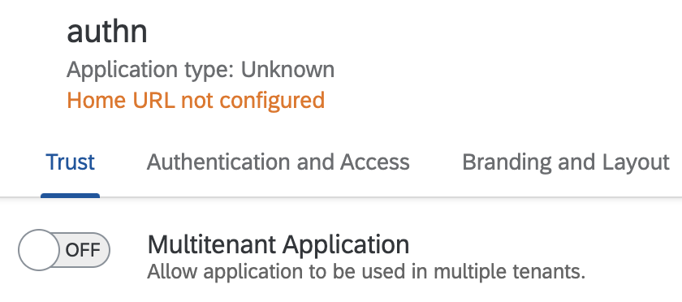

<!--
SPDX-FileCopyrightText: 2020 

SPDX-License-Identifier: Apache-2.0
-->
# Description
This sample uses the [SAP application router](https://www.npmjs.com/package/@sap/approuter) as OAuth 2.0 client and forwards as reverse proxy the requests to a Java backend application running on Cloud Foundry. The application uses [java security](https://github.com/SAP/cloud-security-xsuaa-integration/tree/main/java-security) library to validate the OIDC token before serving a resource to the client: it checks for all incoming requests whether the user is authenticated and whether the user has the requested permissions assigned with **Authorization Management Service (AMS)**.

# Prerequisites
## Check Identity tenant configuration
Identity tenant must be enabled for multi-tenancy in order to configure the identity instance as multi-tenant [`"multi-tenant":true` ](./ias-config.json)
To check if your Identity tenant is enabled for multi-tenancy, go to identity tenant's admin console UI, select any application of the tenant. If you can see the multi-tenant toggle multi-tenancy is enabled:



To enable the IAS-tenant please create a bcp ticket on `BC-IAM-IDS` component.
For additional information see [here](https://github.wdf.sap.corp/CPSecurity/Knowledge-Base/tree/master/08_Tutorials/iasbroker).

# Deployment on Cloud Foundry

## Wizard guided: Create required service instances and deployment
Make sure you're in the root folder of this repository and execute the `deploy.sh` script.
You need to be logged in to your BTP Subaccount with the Cloud Foundry CLI before executing the wizard.

:information_source: [identity service info](https://github.wdf.sap.corp/CPSecurity/Knowledge-Base/tree/master/08_Tutorials/iasbroker) <br>
:information_source: [subscription-manager info](https://int.controlcenter.ondemand.com/index.html#/knowledge_center/articles/7961284168e848efb9e0462e38b4075d)

:bulb: If error `The application cannot be set as multi-tenant` is returned during the identity service creation, it is an indicator that identity tenant is not multi-tenant enabled. Revisit the [Identity tenant prerequisite](#check-identity-tenant-configuration) section.

## Manual steps

### Compile the Java application
Run maven to package the application
```shell
mvn clean package
```

### Configure the manifest
The [vars](../vars.yml) contains hosts and paths that need to be adopted.
- `PROVIDER_SUBACCOUNT_SUBDOMAIN` is the subdomain of your BTP subaccount in which you deploy the application. 
- `SUBSCRIBER_SUBACCOUNT_SUBDOMAIN` is the subdomain of your BTP subaccount where the application will be subscribed from.

On Cloud Foundry your application gets deployed together with [AMS buildpack](https://github.com/SAP/cloud-authorization-buildpack), so that the policy decision runtime is available as a *sidecar*. In the manifest you may need to adapt the ``appName`` and `directories` to your `AMS_DCL_ROOT`. The `directories` serves the `.dcl` files and the data which contains the assignments of users to policies.


### Deploy the application
Deploy the application using cf push. It will expect 1 GB of free memory quota.
During application deployment cloud authorization buildpack is responsible to upload the base policies specified by the application to the AMS. Therefore, the ``AMS_DCL_ROOT`` needs to specify the location of the dcls in the environment.

```shell
cf push --vars-file ../vars.yml
```
> Use cf CLI v7. See Upgrading to [cf CLI v7](https://docs.cloudfoundry.org/cf-cli/v7.html).

### Subscribe to the app from another subaccount
In SAP BTP Cockpit go to another subaccount which is bound to another `identity` tenant. Select `Instances and Subscriptions` from the left pane, click on `Create` button, look for `AMS java-security-sample` in the dropdown list and click on `create`. 

⚠️ Both subaccounts need to reside in the same region (e.g. EU12)


## Access the application
After successful subscription, a link under `Go to Application` button will redirect your request to your identity tenant logon screen on the consumer side. Login with your username and password.
After successful login you should be able to see the index page with a list of links to access different endpoints.
- `/ams-java-app/health` <br>should return "ok" (Status Code `200`). If not check the application logs on provider side (e.g. using `cf logs java-ams --recent`), whether the AMS Service is unavailable (search for `/v1/data/dcr._default_/ping`).
- `/ams-java-app/app/hello-java-security` should return `403`. To access it you will need to go to AMS-UI and assign policies.
- `/ams-java-app/app/java-security` should return `403`. To access it you will need to go to AMS-UI and assign policies.


#### Assign permissions
The link collection has a direct link to the AMS Admin UI to assign the missing permissions. <br>Please follow the [Guide](https://github.wdf.sap.corp/pages/CPSecurity/AMS/Overview/HowTo_AMSConfig/#create-an-admin-user-for-your-ams-tenant) on how to setup the IAS tenant.  

After a delay of maximum 60 seconds, repeat the forbidden test request. A re-login is not required.

> **Note** You can find the link to the AMS user interface in ``VCAP_SERVICES.identity.credentials.authorization_url``.

## Clean-Up
Finally, delete your application and your service instances using the following commands:
```
delete the subscription
cf delete -f java-ams
cf delete -f java-ams-approuter
cf delete-service -f java-security-ias
cf delete-service -f java-ams-sms
```

## Further References
- [Cloud Authorization Service Client Library for Spring Boot Applications](https://github.wdf.sap.corp/CPSecurity/cloud-authorization-client-library-java/tree/master/spring-ams)
- [Authorization Management Service (AMS) - Basics](https://github.wdf.sap.corp/pages/CPSecurity/AMS/Overview/AMS_basics/)
- [Development of a multitenant application in CF](https://pages.github.tools.sap/KernelServices/adoption-guide/cf-sample-app)
- [SaaS Applications](https://pages.github.tools.sap/KernelServices/zones-cookbook/build-on-app)
- [Sample Multitenant IAS-Based Application using SMS](https://github.wdf.sap.corp/CF-PROVISIONING/sample-saas-sms-applications)
- [Integrating Approuter with kernel services](https://github.wdf.sap.corp/CPSecurity/Knowledge-Base/blob/92294ebfdcf27c640bc623e806c5ed93af13b57a/06_Architecture/Identity_Service/approuter.md)
- [IAS Broker](https://github.wdf.sap.corp/CPSecurity/IAS-Broker)
- [How to fetch Token](https://github.com/SAP/cloud-security-xsuaa-integration/blob/main/docs/HowToFetchToken.md)
